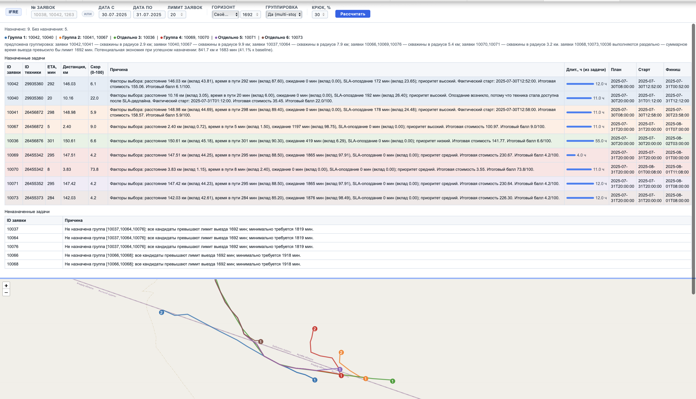
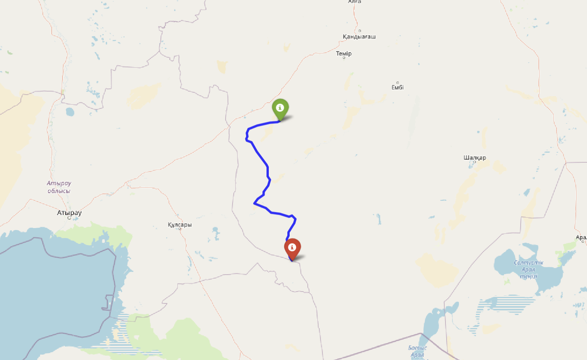

# IFRE — Intelligent Fleet Routing Engine
Интеллектуальный движок маршрутизации автопарка

Прототип сервиса маршрутизации и назначения спецтехники на нефтяном месторождении.
Строит маршруты строго по дорожному графу, рассчитывает ETA с индивидуальной скоростью каждой единицы техники, ранжирует кандидатов по многофакторному скорингу, поддерживает multi‑stop группировку заявок и визуализацию на карте.

## TL;DR

```bash
make env          # создать .envs/.local/.env из примера
# заполнить IFRE_DB_URL
make up           # запустить сервис
# http://127.0.0.1:8000/docs
```

**Демо пакетного планирования:**
```
http://127.0.0.1:8000/demo/batch-plan?start_date=2025-07-30&end_date=2025-07-31&limit=20&planning_mode=custom&max_total_time_minutes=1692&grouping=true&max_detour_pct=30
```



---

## Возможности

- Маршрутизация строго по графу дорог (Dijkstra + KD‑tree, не по прямой)
- ETA с индивидуальной скоростью каждой единицы техники из истории снапшотов
- Ранжирование техники по скорингу (расстояние / ETA / ожидание / SLA‑штраф)
- Совместимость типов работ и техники (жёсткая или со штрафом)
- Batch‑планирование на дату/смену
- Multi‑stop группировка: оценка целесообразности объединения заявок в один выезд
- **VRPTW‑оптимизация через Google OR‑Tools** (`IFRE_USE_ORTOOLS=true`): глобально‑оптимальное распределение задач по технике с временны́ми окнами; при неудаче — автоматический fallback на жадный алгоритм
- **2-opt улучшение порядка задач**: локальный поиск внутри маршрута снижает суммарное расстояние; после 2-opt применяется relocate-оператор для перераспределения между машинами
- **Прогноз длительности задач**: медиана по историческим данным в разрезе `task_type`; при отсутствии данных — глобальная медиана (2 ч по умолчанию)
- Справочные эндпоинты: текущее состояние парка и список скважин
- Визуальная витрина (интерактивная карта Folium + таблицы)
- Понятные причины назначений и отказов
- Опциональная AI‑переформулировка `reason` через OpenAI‑совместимый LLM

---

## Архитектура

```
API (FastAPI)
  ├─ GET  /api/units          ← текущее состояние парка
  ├─ GET  /api/wells          ← справочник скважин
  ├─ POST /api/recommendations ← ранжирование техники под заявку
  ├─ POST /api/route          ← маршрут между двумя точками
  ├─ POST /api/matrix         ← матрица расстояний/времён (node_id или wialon_id/uwi)
  ├─ POST /api/multitask      ← оценка группировки заявок
  ├─ POST /api/assignments    ← пакетное назначение на смену/день
  └─ POST /api/assignments/compare ← сравнение greedy vs OR-Tools
        ↓
RoutingService → Graph (Dijkstra, road_nodes/road_edges, in‑memory)
FleetStateService → снапшоты Wialon, индивидуальная скорость
Repository → PostgreSQL (references.* + tasks или EAV dcm.*)
```

---

## Быстрый старт

```bash
make env    # скопировать .env.example → .envs/.local/.env
make up     # docker compose up
make dev    # с hot reload (bind mount)
make down   # остановить
```

Swagger UI: `http://127.0.0.1:8000/docs`

---

## Тесты

```bash
pip install pytest sqlalchemy psycopg pydantic-settings
pytest tests/ -v
```

Покрытие:
- `TestScoring` — скоринг задач: приоритеты, штраф SLA, start/end time
- `TestStatsDurationModel` — прогноз длительности: медиана по task_type, fallback, фильтрация нулей
- `TestTwoOpt` — 2-opt оптимизатор: короткие списки, улучшение плохого порядка

---

## Переменные окружения

Файлы: `.envs/.local/.env` (локально) / `.envs/.production/.env` (прод). Полный список — `.env.example`.

| Переменная | По умолчанию | Описание |
|---|---|---|
| `IFRE_DB_URL` | — | PostgreSQL connection string |
| `IFRE_DB_SCHEMA` | `references` | Схема БД для дорожного графа и скважин |
| `IFRE_AVG_SPEED_KMPH` | `30.0` | Глобальная скорость (fallback) |
| `IFRE_MIN_SPEED_KMPH` | `5.0` | Минимальная допустимая скорость из истории |
| `IFRE_MAX_SPEED_KMPH` | `120.0` | Максимальная допустимая скорость из истории |
| `IFRE_EDGE_WEIGHT_IN_METERS` | `true` | Веса рёбер в метрах (false = км) |
| `IFRE_SCORE_W_DISTANCE` | `0.30` | Вес расстояния в скоринге |
| `IFRE_SCORE_W_ETA` | `0.30` | Вес времени в пути |
| `IFRE_SCORE_W_WAIT` | `0.15` | Вес времени ожидания |
| `IFRE_SCORE_W_LATE` | `0.25` | Вес штрафа за опоздание по SLA |
| `IFRE_SCORE_POINTS_SCALE` | `10.0` | Масштаб перевода cost → score 0–100 |
| `IFRE_COMPATIBILITY_STRICT` | `false` | Жёсткое исключение несовместимых |
| `IFRE_COMPATIBILITY_PENALTY` | `10.0` | Штраф при мягком режиме совместимости |
| `IFRE_USE_SNAPSHOT_BY_PLANNING_DATE` | `true` | Привязка снапшота к дате планирования |
| `IFRE_ANCHOR_UNITS_AT_PLAN_START` | `true` | Техника считается свободной с начала смены |
| `IFRE_ASSIGNMENTS_GROUPING` | `true` | Группировка по умолчанию при пакетном назначении |
| `IFRE_MAX_TOTAL_TIME_MINUTES_DEFAULT` | `480` | Лимит суммарного времени выезда (мин) |
| `IFRE_USE_ORTOOLS` | `false` | Включить VRPTW‑решатель OR‑Tools вместо жадного (при `grouping=false`) |
| `IFRE_TASK_DOCUMENT_CODES` | `TRS_ORDER,...` | Коды документов EAV для поиска заявок |

### OR‑Tools VRPTW (опционально)

```env
IFRE_USE_ORTOOLS=true
```

Включает VRPTW‑решатель вместо жадного алгоритма при `grouping=false`. Использует метаэвристику Guided Local Search (30 с), при неудаче автоматически переключается на greedy.

### AI‑reason (опционально)

```env
IFRE_REASON_AI_ENABLED=true
IFRE_REASON_AI_API_URL=https://llm.alem.ai/v1/chat/completions
IFRE_REASON_AI_MODEL=qwen3
IFRE_REASON_AI_API_KEY=your_key
```

---

## Эндпоинты

### Справочники

#### `GET /api/units`

Текущее состояние парка техники. Показывает позицию, тип, время доступности и расчётную скорость каждой единицы.

| Query | Тип | Описание |
|---|---|---|
| `planning_time` | datetime (опц.) | Привязать снапшот к конкретному моменту планирования |

```bash
curl 'http://127.0.0.1:8000/api/units?planning_time=2025-07-31T08:00:00'
```

#### `GET /api/wells`

Список скважин из справочника. Поддерживает фильтрацию по UWI.

| Query | Тип | Описание |
|---|---|---|
| `uwi` | string (опц.) | Один или несколько UWI через запятую |

```bash
curl 'http://127.0.0.1:8000/api/wells?uwi=JET_4055,JET_4416'
```

---

### Маршрутизация

#### `POST /api/route`

Кратчайший маршрут по дорожному графу. `from` и `to` принимают `wialon_id`/`uwi` или произвольные координаты.

```bash
curl -X POST http://127.0.0.1:8000/api/route \
  -H 'Content-Type: application/json' \
  -d '{
    "from": {"wialon_id": 29935360},
    "to":   {"uwi": "JET_4055"}
  }'
```

Ответ: `distance_km`, `time_minutes`, `nodes`, `coords` (polyline).

#### `POST /api/matrix`

Матрица расстояний и времён между множеством точек. Принимает либо сырые `node_id`, либо дружелюбные `from_wialon_ids`/`to_uwis` (снаппинг делается внутри).

```bash
# через wialon_id и uwi
curl -X POST http://127.0.0.1:8000/api/matrix \
  -H 'Content-Type: application/json' \
  -d '{
    "from_wialon_ids": [29935360, 26455455],
    "to_uwis": ["JET_4055", "JET_4416"]
  }'

# через node_id (legacy)
curl -X POST http://127.0.0.1:8000/api/matrix \
  -H 'Content-Type: application/json' \
  -d '{
    "start_nodes": [4501, 4498],
    "end_nodes":   [4420, 4431]
  }'
```

---

### Рекомендации

#### `POST /api/recommendations`

Ранжирует доступную технику под конкретную заявку. Возвращает топ‑N кандидатов с баллом и обоснованием.

| Query | По умолчанию | Описание |
|---|---|---|
| `top_units` | `3` | Количество возвращаемых кандидатов |

```bash
curl -X POST 'http://127.0.0.1:8000/api/recommendations?top_units=3' \
  -H 'Content-Type: application/json' \
  -d '{
    "task_id": "10067",
    "priority": "high",
    "destination_uwi": "JET_4055",
    "planned_start": "2025-07-31T20:00:00",
    "duration_hours": 11.0,
    "task_type": "Опрессовка кондуктора Ø 245 мм"
  }'
```

Дополнительные поля запроса:

| Поле | Тип | Описание |
|---|---|---|
| `mode` | `"optimized"` / `"baseline"` | Режим: полный скоринг или nearest‑neighbor baseline |
| `exclude_busy` | bool | Исключать занятую технику |

Ответ на каждого кандидата: `wialon_id`, `name`, `eta_minutes`, `distance_km`, `score` (0–100), `reason`.

---

### Групповые операции

#### `POST /api/multitask`

Оценивает, выгодно ли объединить набор заявок в один выезд. Возвращает группировку, стратегию и экономию относительно baseline.

```bash
curl -X POST http://127.0.0.1:8000/api/multitask \
  -H 'Content-Type: application/json' \
  -d '{
    "task_ids": ["12649", "12653", "12686"],
    "planning_mode": "shift_8"
  }'
```

Ответ: `groups`, `strategy_summary` (`single_unit` / `mixed` / `separate`), `total_distance_km`, `baseline_distance_km`, `savings_percent`, `reason`.

#### `POST /api/assignments`

Пакетное назначение: распределяет все заявки смены по флоту с учётом доступности, SLA и (опционально) multi‑stop группировки. Заявки обрабатываются в порядке приоритета: сначала `high`, затем `medium`, затем `low`; внутри одного приоритета — по `planned_start`.

При `grouping=false` и `IFRE_USE_ORTOOLS=true` используется VRPTW‑решатель OR‑Tools: он строит глобально‑оптимальные мультизаходные маршруты (несколько задач на одну машину в правильном порядке) вместо жадного поочерёдного назначения.

```bash
# по date + shift с группировкой
curl -X POST http://127.0.0.1:8000/api/assignments \
  -H 'Content-Type: application/json' \
  -d '{
    "filters": {"start_date": "2025-07-31", "shift": "night"},
    "grouping": true,
    "planning_mode": "shift_12"
  }'

# OR-Tools VRPTW (без группировки)
curl -X POST http://127.0.0.1:8000/api/assignments \
  -H 'Content-Type: application/json' \
  -d '{
    "task_ids": ["12649", "12653", "12686"],
    "grouping": false
  }'
```

Ответ: `assignments[]` (каждое назначение с маршрутом и временным окном), `unassigned[]` (с причиной), `summary`.

---

### Сравнение алгоритмов: `POST /api/assignments/compare`

Запускает **оба алгоритма параллельно** (жадный и OR-Tools) на одних и тех же задачах и возвращает сравнение:

```bash
curl -s http://localhost:8002/api/assignments/compare -X POST \
  -H "Content-Type: application/json" \
  -d '{"filters": {"start_date": "2025-08-01", "end_date": "2025-09-01", "limit": 5}, "grouping": false}' \
  | python3 -m json.tool
```

Поля ответа:

| Поле | Описание |
|---|---|
| `baseline` | Сводка жадного алгоритма (assigned, avg_score, distance_km, vehicles_used) |
| `optimized` | Сводка OR-Tools |
| `score_improvement_pct` | Прирост среднего балла, % |
| `distance_improvement_pct` | Снижение суммарного пробега, % |
| `vehicles_saved` | Сколько машин сэкономлено (OR-Tools строит multi-stop маршруты) |
| `baseline_assignments` / `optimized_assignments` | Полные списки назначений обоих алгоритмов |

---

### Режимы планирования (`planning_mode`)

Параметр `planning_mode` задаёт горизонт группировки — максимальное суммарное время одного выезда. Доступен в `/api/assignments`, `/api/multitask` и `/demo/batch-plan`.

| Режим | Минуты | Описание |
|---|---|---|
| `shift_8` | 480 | Одна смена 8 ч (стандарт для дневной смены) |
| `shift_12` | 720 | Одна смена 12 ч |
| `day` | 1440 | Одни сутки (**по умолчанию**) |
| `unlimited` | 10 000 000 | Без ограничения по времени выезда |
| `custom` | — | Произвольный горизонт; требует параметр `max_total_time_minutes` (мин) |

Правила приоритета:
- Если передан `planning_mode=custom` — используется значение `max_total_time_minutes`.
- Если передан `planning_mode` (не `custom`) — используется соответствующий лимит из таблицы.
- Если передан `constraints.max_total_time_minutes` — он **перебивает** режим.
- Если не передано ничего — применяется `day` (1440 мин).

```bash
# demo: режим одна смена
http://127.0.0.1:8000/demo/batch-plan?task_ids=12649,12653,12686&planning_mode=shift_8

# demo: без ограничений (объединяет задачи любой длительности)
http://127.0.0.1:8000/demo/batch-plan?task_ids=12649,12653,12686&planning_mode=unlimited
```

---

### Вспомогательные

| Метод | URL | Описание |
|---|---|---|
| `GET` | `/api/tasks` | Список заявок с фильтрацией по дате/смене |
| `GET` | `/api/tasks/debug` | Диагностика: почему часть записей не стала заявками |
| `GET` | `/health` | Проверка доступности сервиса |

---

## Данные и источники

| Таблица | Назначение |
|---|---|
| `references.road_nodes` | Узлы дорожного графа (node_id, lon, lat) |
| `references.road_edges` | Рёбра с весами (source, target, weight) |
| `references.wells` | Скважины (uwi, lon, lat, well_name) |
| `references.wialon_units_snapshot_1/2/3` | Снапшоты позиций техники из Wialon |
| `references.compatibility` (опц.) | Словарь совместимости типов работ и техники |
| `tasks` (если есть) | Заявки в нормализованном виде |
| `dcm.records` + `dcm.record_indicator_values` | EAV-источник заявок (если `tasks` нет) |

Если таблицы `tasks` нет — заявки собираются из EAV по кодам `IFRE_TASK_DOCUMENT_CODES`. Записи без валидной скважины исключаются. Диагностику смотреть в `/api/tasks/debug`.

---

## Скоринг

```
cost  = Wd·distance_km + We·eta_min + Ww·wait_min·prio + Wl·late_min·prio
score = 100 / (1 + cost / SCALE)        # выше → лучше
```

SLA‑дедлайны от `planned_start`:

| Приоритет | Вес | Дедлайн |
|---|---|---|
| high | 0.55 | +2 ч |
| medium | 0.35 | +5 ч |
| low | 0.10 | +12 ч |

ETA каждой единицы рассчитывается с её индивидуальной скоростью из истории снапшотов (медиана по сегментам). Fallback — `IFRE_AVG_SPEED_KMPH`.

---

## Совместимость

Словарь совместимости (`references.compatibility`) определяет, какой тип техники может выполнять какой тип работ.

- `IFRE_COMPATIBILITY_STRICT=true` — несовместимая техника исключается полностью
- `IFRE_COMPATIBILITY_STRICT=false` — допускается со штрафом `IFRE_COMPATIBILITY_PENALTY` к cost
- Техника с неизвестным типом в non-strict режиме получает штраф (а не проходит бесплатно)

---

## Демонстрационные страницы

#### Маршрут на карте

```
http://127.0.0.1:8000/demo/route-map?wialon_id=29935360&uwi=JET_4055
```



#### Пакетный план (таблица + группировка)

```
# с группировкой multi-stop
http://127.0.0.1:8000/demo/batch-plan?task_ids=12649,12653,12686&grouping=true&max_total_time_minutes=20000&max_detour_ratio=1.3

# с ограничением крюка 30% (по умолчанию)
http://127.0.0.1:8000/demo/batch-plan?task_ids=12649,12653,12686&grouping=true&max_detour_pct=30

# без группировки (baseline)
http://127.0.0.1:8000/demo/batch-plan?task_ids=12649,12653,12686&grouping=false

# по дате и смене
http://127.0.0.1:8000/demo/batch-plan?start_date=2025-07-31&shift=night&limit=20

# произвольный горизонт 600 мин
http://127.0.0.1:8000/demo/batch-plan?start_date=2025-07-31&shift=night&limit=20&planning_mode=custom&max_total_time_minutes=600
```

Параметры демо-формы batch-plan:

| Параметр | Тип | По умолчанию | Описание |
|---|---|---|---|
| `task_ids` | string | — | ID заявок через запятую |
| `start_date` | date | — | Дата для фильтрации заявок |
| `shift` | string | — | Смена: `day` / `night` |
| `limit` | int | — | Максимальное число заявок (отбираются по приоритету: high→medium→low) |
| `grouping` | bool | `true` | Включить multi-stop группировку |
| `planning_mode` | string | `day` | Горизонт планирования (см. таблицу режимов) |
| `max_total_time_minutes` | int | — | Используется при `planning_mode=custom` |
| `max_detour_pct` | int | `30` | Максимальный допустимый крюк при группировке, % |

---

## Три демо‑сценария

### Сценарий 1 — срочная заявка (high)

```bash
curl -X POST 'http://127.0.0.1:8000/api/recommendations?top_units=3' \
  -H 'Content-Type: application/json' \
  -d '{
    "task_id": "10067",
    "priority": "high",
    "destination_uwi": "JET_4055",
    "planned_start": "2025-07-31T20:00:00",
    "duration_hours": 11.0,
    "task_type": "Опрессовка кондуктора Ø 245 мм"
  }'
```

Маршрут топ‑1 кандидата:
```
http://127.0.0.1:8000/demo/route-map?wialon_id=29935360&uwi=JET_4055
```

Ожидаемо: система выбирает ближайшую совместимую технику, объясняет ETA и отсутствие риска по SLA.

---

### Сценарий 2 — optimized vs baseline

Для наглядного сравнения включить реалистичную доступность:
```env
IFRE_ANCHOR_UNITS_AT_PLAN_START=false
```

```bash
# optimized: учитывает доступность и SLA
curl -X POST 'http://127.0.0.1:8000/api/recommendations?top_units=1' \
  -H 'Content-Type: application/json' \
  -d '{"task_id":"12635","priority":"medium","destination_uwi":"JET_4416","planned_start":"2025-09-07T20:00:00","duration_hours":2.0,"task_type":"СК3-2-5 Телеметрия"}'

# baseline: просто ближайшая по расстоянию
curl -X POST 'http://127.0.0.1:8000/api/recommendations?top_units=1' \
  -H 'Content-Type: application/json' \
  -d '{"task_id":"12635","priority":"medium","destination_uwi":"JET_4416","planned_start":"2025-09-07T20:00:00","duration_hours":2.0,"task_type":"СК3-2-5 Телеметрия","mode":"baseline"}'
```

Ожидаемо: разные кандидаты — baseline ближе по расстоянию, optimized лучше по SLA.

---

### Сценарий 3 — multi‑stop (3 заявки рядом)

```bash
curl -X POST http://127.0.0.1:8000/api/multitask \
  -H 'Content-Type: application/json' \
  -d '{
    "task_ids": ["12649", "12653", "12686"],
    "planning_mode": "unlimited"
  }'
```

Витрина с группировкой vs без:
```
http://127.0.0.1:8000/demo/batch-plan?task_ids=12649,12653,12686&grouping=true&planning_mode=unlimited
http://127.0.0.1:8000/demo/batch-plan?task_ids=12649,12653,12686&grouping=false&planning_mode=unlimited
```

Ожидаемо: при `grouping=true` задачи объединяются в один выезд, `savings_percent` показывает экономию по пробегу.

---

## Диагностика

- `GET /api/tasks/debug` — почему часть EAV-записей не стала заявками (нет скважины, нет UWI, неизвестный тип документа)
- `GET /api/units` — убедиться, что снапшоты техники загружены корректно
- Ошибки отсутствующих таблиц не скрываются, пробрасываются напрямую

---

## Ограничения

- Качество маршрутов зависит от плотности и актуальности дорожного графа
- Средняя скорость считается медианой по истории снапшотов; если снапшотов мало — используется fallback
- Прогноз длительности задач (`DurationForecaster`) использует медиану по историческим данным в разрезе `task_type`; полноценная ML‑модель (`MLDurationModelStub`) — заглушка, обучение на actuals не реализовано
- OR‑Tools VRPTW работает только при `grouping=false`; при `grouping=true` применяется кластеризация + жадное назначение групп
- OR‑Tools ограничивает число машин до `N+2` (лучших кандидатов), где N — количество задач; при timeout (30 с) или infeasible — fallback на greedy
